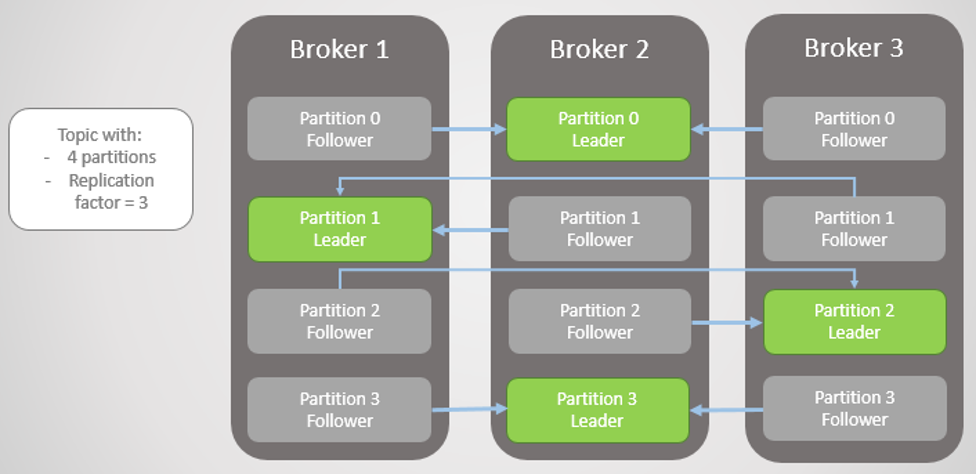

# 3주차 카프카 Internal

## 멤버쉽 && 컨트롤러

- 카프카는 주키퍼의 임시 노드를 사용해서 컨트롤로를 선출한다. 

- 주키퍼의 Watch를 통해 모든 브로커가 노드의 변경사항을 알게 된다. 

- 컨트롤러는 리더의 선출 책임을 갖는다. 

### 멤버쉽

데이터를 저장하는 노드를 znode라고 한며 이름 앞에 /를 붙이고 디렉토리처럼 노드를 식별한다. 

카프카의 최상위 노드 : /kafka-main

자식 :  /kafka-main/controller, /kafka-main/broker,  /kafka-main/config (topic정보)

 
### 컨트롤러 
카프카 브로커 중 하나이며, 일반 브로커의 기능에 추가하여 파티션 리더를 선출하는 책임을 갖는다. 

클러스터에서 시작하는 첫 번째 브로커가 컨트롤러가 된다. 

주키퍼를 통해 생성하게 되는데, 새롭게 선출될 때 마다 주키퍼로부터 컨트롤러 세대 번호를 받는다. 

따라서  변경 전의 컨트롤러와 혼동되지 않는다. 

리더가 클러스터를 떠났다는 것을 컨트롤러가 인자하면, 모든 파티션들에 새로운 리더가 필요하다는 것을 알게 된다.

컨트롤러는 새로운 리더을 필요로 하는 모든 파티션들을 점검하고 새로 리더가 될 브로커를 결정한다.

follwer들의 정보를 모든 브로커들에게 전송한다. 

새롭게 결정된 파티션의 리더는 프로듀서와 컨슈머의 요청 처리를 시작해야 한다는 것을 알고 있다.

또한 팔로어들은 새로운 리더의 메시지 복제를 시작해야 한다는 것을 안다.

## 복제

https://needjarvis.tistory.com/604

## 요청 처리

카프카 브로커가 하는 일은 대부분 클라이언트의 파티션 라플리카 및 컨트롤러로부터 파티션 리더에게 전송된 요청을 처리하는 일이다. 

### 표준 헤더

- type : 요청 type으로 0은 produce / 1은 fetch
- version : api version
- cID : 고육 식별 값 
- 클라아이언트 ID : nullable, 요청한 클라이언트 식별  

### 동작 과정 

1. acceptor 스레드로 연결 생성
2. processor 스레드로 연결 받고 요청 큐에 넣고 응답 큐에서 응답을 가져와 클라이언트에게 전송 

- 쓰기 요청 : 프로듀서가 전송하며 카프카 브로커에게 쓰려는 메시지를 포함한다. 
- 읽기 요청 : 브로커로부터 메시지를 읽을 때 컨슈머와 팔로어 리플리카가 전송한다. 

읽기 / 쓰기 요청은 모두 리더에게 전송되어야 하는데, 클라이언트는 메타데이터를 통해 구분한다. 

## ISSUE

- 선호 리더.. 이해가 잘 가지 않는다.

- Consumer Group 가끔 등장, 위치는 어디일까??

